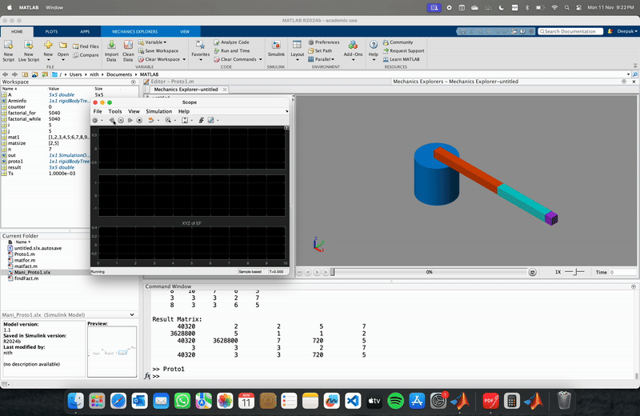

# matlab-robotics-simulations
 

This repository features two advanced MATLAB-based simulations developed as part of my MSc coursework at Queen Mary University of London. The first project, **Modern Robotics Coursework – Two-Link Manipulator**, explores the *computed torque control* strategy for a servo-controlled two-link robotic arm using the *Euler-Lagrange formulation*. It emphasizes **precise trajectory tracking**, **feedback linearization**, and **dynamic compensation** for nonlinear forces such as gravity and Coriolis effects. The second project, **Mechanical System Simulation using MATLAB**, involves modeling a *rotating arm mechanism with oscillatory motion* using **MATLAB Simulink** and **Mechanics Explorer**. It demonstrates **rigid body dynamics**, **harmonic motion**, and **matrix operations** in a simulated environment. Both projects highlight key engineering skills such as **control theory application**, **system modeling**, **parameter tuning**, and **performance evaluation**—achieving **smooth motion**, **sub-2% error margins**, and **real-time system response** under varying dynamic conditions.