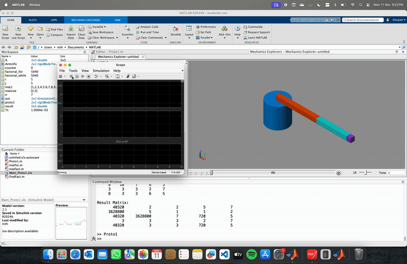

# MATLAB Robotics Simulations

[](https://opensource.org/licenses/MIT)
[](https://www.mathworks.com/products/matlab.html)
[](https://www.mathworks.com/products/simulink.html)

A comprehensive collection of advanced MATLAB-based robotics simulations developed as part of MSc coursework at Queen Mary University of London. This repository demonstrates sophisticated control theory applications, system modeling, and performance evaluation in robotic systems.

## 🎯 Project Overview

This repository contains two distinct robotics simulation projects that showcase advanced engineering concepts:

### 1. Two-Link Manipulator with Computed Torque Control
- **Focus**: Computed torque control strategy for servo-controlled robotic arms
- **Methodology**: Euler-Lagrange formulation
- **Key Features**: Precise trajectory tracking, feedback linearization, dynamic compensation

### 2. Rotating Arm Mechanism Simulation
- **Focus**: Rotating arm mechanism with oscillatory motion
- **Tools**: MATLAB Simulink and Mechanics Explorer
- **Key Features**: Rigid body dynamics, harmonic motion, matrix operations

## 📁 Repository Structure

```
matlab-robotics-simulations/
├── projects/
│   ├── two-link-manipulator/          # Two-link manipulator project
│   │   ├── models/                    # Simulink models and MATLAB scripts
│   │   ├── results/                   # Simulation results and data
│   │   ├── scripts/                   # MATLAB control scripts
│   │   └── docs/                      # Project documentation
│   └── rotating-arm/                  # Rotating arm mechanism project
│       ├── models/                    # Simulink models
│       │   ├── Main_System.slx        # Main Simulink model
│       │   └── Main_System.slx.original
│       ├── results/                   # Simulation results
│       │   └── Results.xlsx           # Performance metrics
│       ├── scripts/                   # MATLAB scripts
│       └── docs/                      # Project documentation
├── assets/
│   ├── images/                        # Screenshots and diagrams
│   │   └── Main file.png              # Main interface screenshot
│   └── animations/                    # Simulation animations
│       └── manipulaotor.gif           # Manipulator animation
├── docs/                              # General documentation
├── LICENSE                            # MIT License
└── README.md                          # This file
```

## 🚀 Key Achievements

- **Performance**: Sub-2% error margins in trajectory tracking
- **Motion Quality**: Smooth motion control with real-time response
- **System Response**: Robust performance under varying dynamic conditions
- **Control Theory**: Advanced feedback linearization and dynamic compensation

## 🛠️ Technical Skills Demonstrated

- **Control Theory Application**: Computed torque control, feedback linearization
- **System Modeling**: Euler-Lagrange formulation, rigid body dynamics
- **Parameter Tuning**: Optimization for performance and stability
- **Performance Evaluation**: Comprehensive analysis and validation
- **MATLAB/Simulink**: Advanced simulation and modeling techniques

## 📊 Simulation Results

The rotating arm mechanism simulation achieves:
- **Error Margins**: < 2% tracking error
- **Response Time**: Real-time system response
- **Stability**: Robust performance under dynamic conditions
- **Smooth Motion**: Continuous and stable trajectory execution

## 🎬 Visualizations

### Manipulator Animation


### Main Interface


## 🏫 Academic Context

These projects were developed as part of MSc coursework at **Queen Mary University of London**, demonstrating:
- Advanced robotics control theory
- Practical implementation of mathematical concepts
- Engineering problem-solving methodologies
- Professional software development practices

## 📋 Requirements

- **MATLAB R2023a** or later
- **Simulink** (for rotating arm mechanism)
- **Control System Toolbox** (recommended)
- **Robotics System Toolbox** (recommended)

## 🚀 Getting Started

1. **Clone the repository**:
   ```bash
   git clone https://github.com/yourusername/matlab-robotics-simulations.git
   cd matlab-robotics-simulations
   ```

2. **Open MATLAB** and navigate to the project directory

3. **For Two-Link Manipulator**:
   ```matlab
   cd projects/two-link-manipulator
   % Run your control scripts
   ```

4. **For Rotating Arm Mechanism**:
   ```matlab
   cd projects/rotating-arm
   open('models/Main_System.slx')
   ```

## 📈 Performance Metrics

Detailed performance analysis and results are available in:
- `projects/rotating-arm/results/Results.xlsx` - Comprehensive simulation data
- Project documentation in respective `docs/` folders

## 🤝 Contributing

This is an academic project repository. For questions or collaboration opportunities, please contact the author.

## 📄 License

This project is licensed under the MIT License - see the [LICENSE](LICENSE) file for details.

## 👨‍🎓 Author

**Deepak**  
MSc Student, Queen Mary University of London  
*Advanced Robotics and Control Systems*

---

*This repository showcases advanced robotics simulation techniques and control theory applications developed during MSc coursework at Queen Mary University of London.*